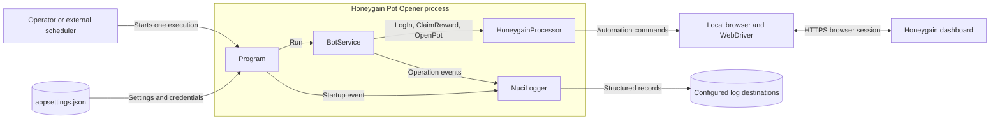
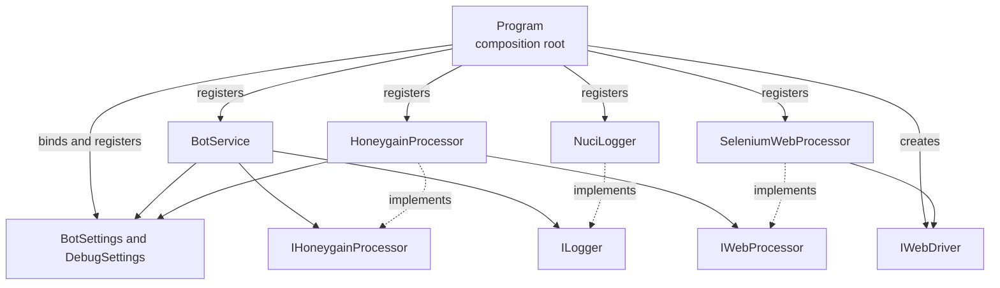
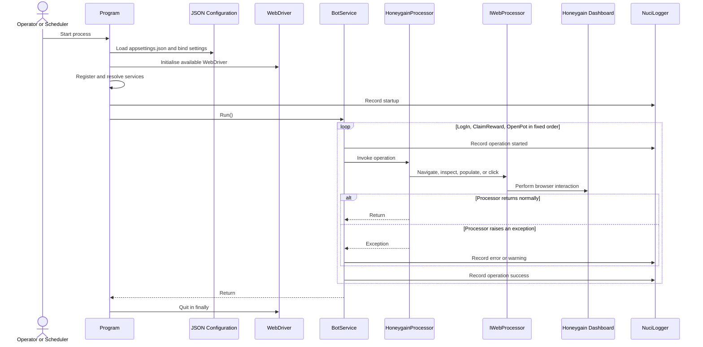
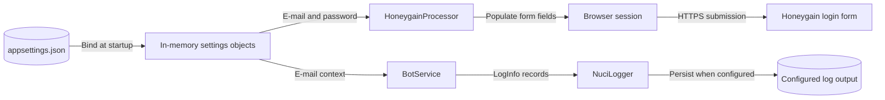
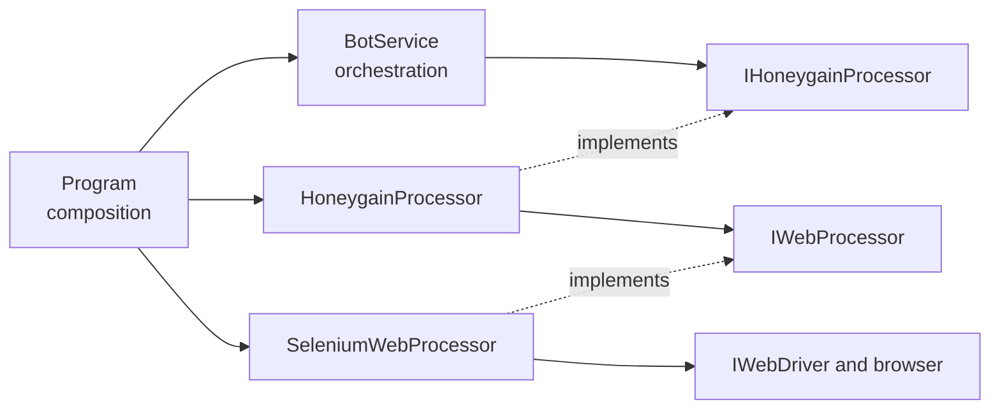

# Honeygain Pot Opener Architecture

This document describes the current architecture of Honeygain Pot Opener. It covers the local console process, its browser-automation pipeline, external Honeygain interaction, configuration and logging boundaries, and contributor-facing constraints; it does not describe Honeygain internals or the internal implementation of third-party packages.

## 📑 Table of Contents

- [Table of Contents](#table-of-contents)
- [Purpose](#purpose)
- [System Context](#system-context)
- [Architectural Style](#architectural-style)
- [Runtime Flow](#runtime-flow)
- [Components](#components)
- [Data Architecture](#data-architecture)
- [Interfaces and Integrations](#interfaces-and-integrations)
- [Cross-Cutting Concerns](#cross-cutting-concerns)
  - [Security and Privacy](#security-and-privacy)
  - [Error Handling](#error-handling)
  - [Observability](#observability)
  - [Configuration](#configuration)
  - [Concurrency and Resource Use](#concurrency-and-resource-use)
- [Dependency Direction and Rules](#dependency-direction-and-rules)
- [External Dependencies](#external-dependencies)
- [Deployment and Operations](#deployment-and-operations)
- [Compatibility Contracts](#compatibility-contracts)
- [Testing and Verification](#testing-and-verification)
- [Design Constraints](#design-constraints)
- [Extension Points](#extension-points)
  - [Honeygain Processing](#honeygain-processing)
  - [Browser Automation](#browser-automation)
- [Source Map](#source-map)
- [Related Documentation](#related-documentation)

## 🎯 Purpose

Honeygain Pot Opener automates one Honeygain dashboard session per process invocation. It authenticates with configured credentials, attempts to claim an available achievement reward, attempts to open the Lucky Pot, records operation events, and closes the browser session. This document assists contributors in locating responsibility, preserving dependency direction, evaluating selector and lifecycle modifications, and recognising guarantees that the current implementation does not provide.

## 🌐 System Context

An operator or external scheduler initiates the application. The process reads local configuration, controls a local browser through Selenium, exchanges data with the remote Honeygain dashboard, and emits logs to configured NuciLog destinations. The repository contains no database, server endpoint, internal scheduler, or durable queue.



The principal external boundaries are:
- **Process initiator:** Starts one execution and owns any recurring schedule; the application itself does not schedule subsequent executions.
- **Configuration file:** Supplies local settings and Honeygain credentials. The operator owns its contents, permissions, and retention.
- **Browser and WebDriver:** Provide the local automation runtime. The process creates one driver instance and owns its termination during the guarded execution path.
- **Honeygain dashboard:** Owns authentication, reward availability, Lucky Pot availability, page structure, and remote account data.
- **Log destinations:** Persist configured operation records and can contain the configured Honeygain e-mail address.

## 🏗️ Architectural Style

The application is a dependency-injected, synchronous console pipeline with a composition root, an orchestration service, and a browser-integration adapter. [`Program.cs`](./Program.cs) selects concrete implementations and lifetimes; [`BotService`](./Service/BotService.cs) defines operation order and degradation policy; [`HoneygainProcessor`](./Processors/HoneygainProcessor.cs) translates domain operations into browser commands. This separation confines Honeygain selectors to the processor and Selenium selection to the composition boundary.



The principal architecture boundaries are:
- **Composition boundary:** `Program` loads configuration, creates the WebDriver, registers services, resolves the entry service, and terminates the driver.
- **Orchestration boundary:** `IBotService` exposes one process-level operation, while `BotService` owns ordering, logging, and continuation after processor failures.
- **Honeygain integration boundary:** `IHoneygainProcessor` defines login, reward, and pot operations; `HoneygainProcessor` owns dashboard URLs and selectors.
- **Browser infrastructure boundary:** `IWebProcessor` isolates browser commands from Honeygain orchestration, while `SeleniumWebProcessor` supplies the selected implementation.
- **Cross-cutting boundary:** NuciLog owns structured event production, and settings classes transport configuration into runtime components.

## 🔄 Runtime Flow



The principal runtime sequence is:
1. `Program` loads the optional JSON file with change monitoring enabled and binds `BotSettings` and `DebugSettings` once.
2. `Program` initialises an available WebDriver before constructing the dependency-injection container.
3. The composition root registers settings, the WebDriver, logging, browser processing, Honeygain processing, and orchestration services, then records startup.
4. `BotService.Run` invokes `LogIn`, `ClaimReward`, and `OpenPot` synchronously and in that fixed order.
5. `HoneygainProcessor` translates each operation into `IWebProcessor` calls. Login navigates to the dashboard login page, handles cookie consent, submits credentials, and waits for dashboard content.
6. `BotService` catches each processor exception, records it, and continues. Reward failures use warning severity; login and Lucky Pot failures use error severity.
7. After each operation, `BotService` records success regardless of whether the operation previously raised an exception.
8. When the guarded call to `BotService.Run` concludes or escapes, `Program` terminates the WebDriver in `finally`.

## 🧩 Components

| Component | Responsibility | Principal Dependencies | Lifetime or Ownership |
|-----------|----------------|------------------------|-----------------------|
| `Program` | Loads configuration, composes services, initiates orchestration, records fatal failures, and terminates the browser. See [`Program.cs`](./Program.cs). | Microsoft configuration and dependency injection, NuciLog, WebDriver initialiser | Static process entry point; owns process startup and the driver cleanup call. |
| `BotSettings` and `DebugSettings` | Transport credentials and browser visibility settings. See [`Configuration/`](./Configuration/). | JSON configuration binding | Singleton objects bound once during startup. |
| `BotService` | Defines the fixed operation order, emits operation events, and applies best-effort continuation. | `IHoneygainProcessor`, `BotSettings`, `ILogger` | Registered as a singleton. |
| `HoneygainProcessor` | Owns Honeygain URLs, selectors, login interaction, reward detection, and Lucky Pot interaction. | `IWebProcessor`, `BotSettings` | Registered as a singleton. |
| `SeleniumWebProcessor` | Implements generic web operations used by the Honeygain adapter. | `IWebDriver` | Registered as transient, then retained by the singleton `HoneygainProcessor` that receives it. |
| `IWebDriver` | Owns the browser session and executes Selenium commands. | Locally available browser automation support | One instance per process; created and terminated by `Program`. |
| `NuciLogger` | Emits startup, operation status, exception, and context records. | NuciLog settings from configuration | Registered as a singleton. |

## 💾 Data Architecture

The application has no database, cache, migration mechanism, or repository-owned remote data model. Its durable local state consists of operator-managed JSON configuration and any file output activated through NuciLog. Credentials become an in-memory settings snapshot, enter browser form fields during login, and are then subject to the browser and Honeygain session lifecycle. The e-mail address, but not the password, is deliberately supplied as operation log context.



| Data or Store | Owner | Representation and Storage | Lifecycle or Consistency |
|---------------|-------|----------------------------|--------------------------|
| `appsettings.json` | Operator; loaded by `Program` | Local JSON in the working directory | Persists until the operator modifies or deletes it; no migration or validation phase exists. |
| Runtime settings | Composition root and dependency-injection container | `BotSettings` and `DebugSettings` objects in process memory | Bound once at startup and shared as singletons for the process lifetime. |
| Browser session | `IWebDriver` and Honeygain | Browser-managed cookies, page state, and remote account session | Created once per invocation and terminated by `Quit` after the guarded orchestration path. |
| Operation logs | `NuciLogger` | Configured destinations; file output defaults to `./logfile.log` | Retention, rotation, and deletion are not defined by this repository. |

## 🔌 Interfaces and Integrations

| Interface or Integration | Direction | Contract | Owner | Failure Semantics |
|--------------------------|-----------|----------|-------|-------------------|
| Process entry point | Inbound | Operating-system process invocation; no application command-line options are defined | `Program` | Exceptions from the guarded orchestration call are logged as fatal, but no explicit non-zero exit code is assigned. Earlier startup exceptions are outside that guard. |
| `appsettings.json` | Inbound | JSON sections for bot, debug, and NuciLog settings | `Program` and configuration binder | A missing file is accepted by the provider; absent values can fail at their point of use. Invalid JSON can terminate startup. |
| Browser automation | Outbound | Synchronous `IWebProcessor` operations implemented by Selenium | `HoneygainProcessor` | Browser exceptions propagate to `BotService`, which records them and continues to the subsequent operation. |
| Honeygain dashboard | Outbound | HTTPS web interface identified by configured URLs, element identifiers, and visible text | `HoneygainProcessor` | Missing reward and pot controls can become `InvalidOperationException`; other navigation and selector failures propagate from the automation library. No repository-defined retry exists. |
| NuciLog destinations | Outbound | Structured operation, status, exception, and `Username` context records | `Program` and `BotService` | No repository-defined fallback exists if logging itself fails. |

## 🧵 Cross-Cutting Concerns

### Security and Privacy

Honeygain credentials reside as plain text in the local configuration file and are transmitted through the HTTPS Honeygain login page by the browser. The repository defines no environment-variable provider, credential vault, encryption facility, local authorisation model, or credential redaction layer. File permissions and secret hygiene therefore remain operator responsibilities. Operation logs include the configured e-mail address under the `Username` key; no logging call supplies the password.

The local process-to-file boundary and the browser-to-Honeygain boundary are the material trust transitions. Contributors must not introduce credential values into source, logs, exceptions, diagrams, or test fixtures.

### Error Handling

`HoneygainProcessor` reports unavailable reward and pot controls with `InvalidOperationException`; automation dependencies can raise additional exceptions. `BotService` catches every exception independently for login, reward, and pot operations. It records reward failures as warnings and the other operation failures as errors, then continues. Each method emits a success event after its `catch`, so a success record is currently not evidence that the browser operation completed.

`Program` catches `AggregateException` and general exceptions only around service resolution and `IBotService.Run`, records fatal events, and terminates the WebDriver in `finally`. Configuration loading, WebDriver initialisation, container construction, and logger resolution occur before this guard. Failures during those phases can terminate directly, and a failure after driver creation but before entry into the guard can bypass explicit driver termination. No retry or compensating action is implemented.

### Observability

NuciLog receives a startup information event and started, failure, and success events for `LogIn`, `ClaimReward`, and `OpenPot`. Operation events carry the configured e-mail address as `Username` context. The configured default activates file output at `./logfile.log` with minimum level `Info`.

The repository defines no metrics, traces, health endpoint, audit store, correlation identifier beyond the account context, or automatic log-retention policy. Unconditional success events after caught failures limit the reliability of log-derived operation outcomes.

### Configuration

| Configuration Area | Source | Responsibility | Override or Secret Policy |
|--------------------|--------|----------------|---------------------------|
| `botSettings` | `appsettings.json` | Supplies the Honeygain e-mail address and password. | No override provider or secret store is configured; populated values must remain local. |
| `debugSettings` | `appsettings.json` | Selects visible debug automation versus headless execution. | No alternate source is configured. |
| `nuciLoggerSettings` | `appsettings.json` | Selects log path, minimum level, and file output. | No alternate source is configured in this repository. |

The JSON provider marks the file as optional and activates change monitoring. `BotSettings` and `DebugSettings` are nevertheless bound once and registered as singleton objects, so modifications do not refresh those objects during an active process. No environment or command-line configuration providers participate in precedence.

### Concurrency and Resource Use

The repository expresses a synchronous, single-pass process with no tasks, parallel branches, queues, worker pool, or shared-state synchronisation. One WebDriver serves the process. `BotService`, `HoneygainProcessor`, settings, logger, and driver are singleton registrations; the transient `IWebProcessor` is retained by the singleton processor after resolution.

The guarded orchestration path always calls `IWebDriver.Quit` in `finally`. The service provider itself is not disposed explicitly. The application defines no backpressure, invocation lock, or coordination across concurrent process instances, so concurrent executions are outside its guarantees.

## 🧭 Dependency Direction and Rules

Dependencies proceed from composition to orchestration, then through interfaces to integration infrastructure. The composition root is the only repository component that selects `SeleniumWebProcessor`, `NuciLogger`, and concrete service lifetimes. `BotService` depends on the Honeygain contract rather than browser infrastructure, while `HoneygainProcessor` depends on the generic web-processing contract rather than orchestration.



The principal dependency rules are:
- `Program` owns concrete implementation selection, service lifetime selection, process startup, and browser termination.
- `BotService` owns workflow order and failure continuation but must not own Honeygain selectors or depend directly on Selenium types.
- `HoneygainProcessor` owns Honeygain URLs and selectors but must not own process scheduling, dependency registration, or top-level resource termination.
- Browser automation must pass through `IWebProcessor`; orchestration must pass through `IHoneygainProcessor`.
- Configuration and logging types may be consumed by runtime components but must not depend on service or processor implementations.
- External Honeygain interface revisions must be isolated within the processor unless they alter an explicit orchestration contract.

## 📦 External Dependencies

| Dependency | Responsibility | Integration Boundary | Architectural Consequence |
|------------|----------------|----------------------|---------------------------|
| `.NET 10.0` | Hosts the executable and base runtime | `HoneygainPotOpener.csproj` | Runtime and compilation compatibility follow the `net10.0` target. |
| `Microsoft.Extensions.Configuration` and `Microsoft.Extensions.DependencyInjection` 10.0.5 | Supply JSON binding and runtime composition | `Program` | Configuration shape and registered lifetimes are centralised in the composition root. |
| `NuciWeb` 4.0.0, `NuciWeb.Automation` 1.0.0, and `NuciWeb.Automation.Selenium` 1.0.1 | Supply selectors, browser abstractions, WebDriver discovery, and Selenium execution | `HoneygainProcessor` and `Program` | Browser capability and wait semantics depend on these packages; `IWebProcessor` is the substitution boundary. |
| `NuciLog` 1.2.0 and `NuciLog.Core` 2.6.0 | Supply structured operation logging | `Program` and `BotService` | Logging configuration and event semantics depend on NuciLog contracts. |
| Honeygain dashboard | Supplies authentication, rewards, Lucky Pot state, and page structure | `HoneygainProcessor` through the browser | Upstream interface revisions can invalidate selectors without a compile-time signal. |
| Local browser and WebDriver | Execute the automated web session | `IWebDriver` and `SeleniumWebProcessor` | A compatible local browser environment is necessary for runtime operation. |
| Maintainer deployment script | Produces release artefacts through the remotely retrieved .NET 10 release helper | `release.sh` | Release execution depends on external mutable content and requires inspection before maintainer use. |

## 🚀 Deployment and Operations

The deployment unit is a single console executable with `appsettings.json` copied beside the compiled output. Published archives target Linux, macOS, and Windows architectures. The application does not install a service, expose a network listener, or schedule itself; operators execute it directly or provide an external scheduler. Runtime egress is the browser-mediated Honeygain HTTPS session.

Configuration and logs use paths relative to the working directory. There is no application-owned durable state requiring migration, replication, or restoration. One invocation controls one browser session and performs one account workflow. The release script delegates packaging to a remotely retrieved maintainer script rather than implementing publication within this repository.

| Concern | Current Design | Architectural Consequence |
|---------|----------------|---------------------------|
| Process topology | One local console process and one browser session per invocation | No server availability or horizontal scaling model exists. |
| Scheduling | No internal timer or recurring host | Repetition must be initiated externally. |
| Persistent state | Local configuration and optional log output only | Operators own file protection, retention, and cleanup; no data migration exists. |
| Network | Browser egress to the Honeygain HTTPS dashboard | Honeygain and browser availability determine runtime success. |
| Shutdown | `IWebDriver.Quit` executes after the guarded orchestration path | Earlier startup failures can bypass the explicit cleanup path. |
| Exit status | Caught orchestration exceptions are logged without assigning a non-zero process code | External schedulers cannot infer operation success solely from the exit status. |
| Parallel invocation | No inter-process lock or coordination | Concurrent executions for an identical account are not an architectural guarantee. |

## 🛡️ Compatibility Contracts

| Contract | Owner | Invariant | Verification | Change Policy |
|----------|-------|-----------|--------------|---------------|
| `appsettings.json` shape | `Program` and settings classes | Sections bind to `BotSettings`, `DebugSettings`, and NuciLog settings; credential and browser-mode keys retain their configured meanings. | Startup configuration check and manual execution | Coordinate key modifications with settings types, sample configuration, and documentation. |
| Operation order | `BotService` | `LogIn` precedes `ClaimReward`, which precedes `OpenPot`; failures currently do not prevent subsequent operations. | Orchestration unit tests when introduced and manual log inspection | Treat reordering or altered failure continuation as a workflow contract modification. |
| Honeygain selectors | `HoneygainProcessor` | Login, cookie consent, dashboard readiness, reward, and Lucky Pot controls correspond to current Honeygain identifiers and visible text. | Visible-browser end-to-end execution | Revise selectors together and verify both presence and absence paths after upstream interface modifications. |
| Browser mode | `DebugSettings` and `Program` | Debug mode produces visible automation; the default performs headless automation. | Manual execution in both modes | Preserve configuration semantics or document a migration. |
| Log operation identity | Logging types and `BotService` | Operation names remain `LogIn`, `ClaimReward`, and `OpenPot`, with the e-mail address recorded under `Username`. | Log inspection | Coordinate modifications with any external log consumer and privacy documentation. |
| Processor contracts | `IBotService` and `IHoneygainProcessor` | Synchronous methods represent one complete orchestration pass and the three Honeygain operations. | Compilation and contract-focused tests when introduced | Modify implementations behind existing interfaces where possible; revise composition and callers for contract changes. |

## ✅ Testing and Verification

The repository currently contains no test project. The GitHub Actions workflow restores dependencies, compiles the project, and invokes `dotnet test`, but the test command does not execute a repository-owned suite. Compilation therefore provides the only automated verification currently present; browser interaction, selector compatibility, operation ordering, degradation, and resource cleanup require manual verification.

Execute the principal automated verification with:

```bash
dotnet restore
dotnet build --no-restore
dotnet test --no-build --verbosity normal
```

Manual architecture-sensitive verification requires an authorised Honeygain account and compatible browser environment. Execute with debug mode activated to inspect login, cookie-consent, reward-present, reward-absent, pot-available, pot-unavailable, and login-failure paths. Confirm that the browser terminates and inspect logs with cognisance that success events are emitted after caught failures.

Material coverage gaps include orchestration ordering, exception continuation, status accuracy, JSON binding, WebDriver cleanup, selector validity, browser-mode selection, and release-platform execution.

## ⚠️ Design Constraints

- **Upstream Interface Coupling:** Honeygain element identifiers and visible text are embedded in `HoneygainProcessor`; dashboard revisions can interrupt operation without compile-time detection.
- **Single-Pass Execution:** The synchronous workflow performs one account pass and exits; scheduling, queuing, parallelism, and retry policy are external concerns.
- **Best-Effort Status Semantics:** Operation exceptions are recorded and suppressed, subsequent operations proceed, and success is then recorded unconditionally. Logs and process exit status do not provide a definitive success contract.
- **Plain-Text Secrets:** Credentials reside in local JSON because no secret-provider integration exists. Repository safety depends on operator file protection and source-control discipline.
- **Partial Lifecycle Guard:** Configuration, driver initialisation, dependency composition, and logger resolution occur before the guarded `try`/`finally`, leaving an early-failure cleanup and diagnostic gap.
- **Snapshot Configuration:** File change monitoring is activated, but bound bot and debug settings remain startup snapshots for the process lifetime.
- **Absent Automated Coverage:** No repository-owned tests protect selectors, ordering, error semantics, or resource lifetime.

## 🔧 Extension Points

### Honeygain Processing

1. Implement or revise [`IHoneygainProcessor`](./Processors/IHoneygainProcessor.cs) while preserving the synchronous `LogIn`, `ClaimReward`, and `OpenPot` operations.
2. Register the implementation at the dependency-injection boundary in [`Program.cs`](./Program.cs).
3. Add contract and orchestration verification for operation order, exception semantics, and all altered integration paths.

`BotService` expects processor exceptions to communicate unsuccessful operations and currently continues after each exception. A substitute must preserve that interaction or coordinate an explicit orchestration contract modification.

### Browser Automation

1. Implement `IWebProcessor` or integrate another compatible NuciWeb automation adapter.
2. Revise the `IWebProcessor` registration and any driver construction or cleanup in [`Program.cs`](./Program.cs).
3. Verify navigation, visibility waits, text population, clicks, debug visibility, and resource termination.

The selected processor is retained by a singleton `HoneygainProcessor` during one process execution. A substitute must align its resource lifetime with that ownership and preserve the synchronous browser-operation contract.

## 🗺️ Source Map

| Area | Path |
|------|------|
| Composition root and process lifecycle | `Program.cs` |
| Project target and package dependencies | `HoneygainPotOpener.csproj` |
| Configuration contracts | `Configuration/` |
| Workflow orchestration | `Service/` |
| Honeygain integration | `Processors/` |
| Structured logging identifiers | `Logging/` |
| Runtime configuration | `appsettings.json` |
| Continuous integration | `.github/workflows/dotnet.yml` |
| Release delegation | `release.sh` |

## 📚 Related Documentation

- [README.md](./README.md) documents installation, configuration, execution, troubleshooting, contribution, and licensing guidance.